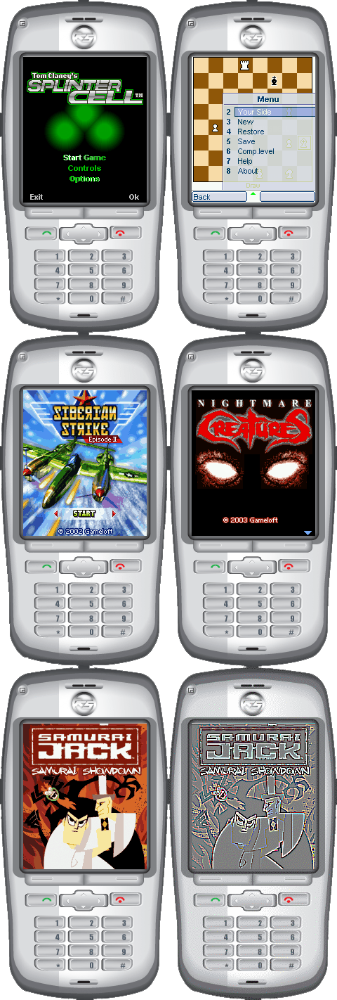

# Midp2Exe & MidpX

> **A blast from the past**: Convert J2ME/MIDP mobile applications to Windows executables

[](LICENSE)
[](#system-requirements)
[](#)

## 📱 The Story

Back in 2004, before smartphones dominated the world, Java 2 Micro Edition (J2ME) was the standard for mobile applications. Nokia, Sony Ericsson, and Motorola phones ran games and apps packaged as JAR files. But there was always one question: **"Can we run these on PC?"**

That's why Midp2Exe and MidpX were created.

**Midp2Exe** converts J2ME/MIDP applications (JAR/JAD files) into standalone Windows executables. Simply put, it brings mobile games from your Nokia phone to your desktop.

**MidpX** takes it further—it's a complete J2ME software management platform integrated into Internet Explorer and Windows Explorer, featuring OTA (Over The Air) provisioning support.

This project is now open-sourced as a piece of software archaeology, preserving a fascinating era of mobile development history.

## 🎮 Preview

Here are some classic J2ME games running on Windows via Midp2Exe:


## 📦 Screenshots


## 📦 Downloads

### Current Version: 1.3.0 (2004) (New 1.3.0 Runtime with Legacy 1.2.0 converted tools)

| File | Description | Size |
|------|-------------|------|
| [Midp2Exe120.zip](../../releases) | **Main converter tool** - Converts JAR files to EXE | 63 KB |
| [MidpRuntimeDLL130.zip](../../releases) | **Required Runtime DLLs** - Necessary for running converted apps | 788 KB |
| [MidpX.zip](../../releases) | **MidpX Browser Integration** - IE toolbar (legacy, not recommended) | 1755 KB |

> 📥 All files are available in the [Releases](../../releases) section

## 🚀 Quick Start

### 1. Download Required Files

You'll need:
- ✅ `Midp2Exe120.zip` - The converter
- ✅ `MidpRuntimeDLL130.zip` - Runtime libraries

### 2. Install Runtime DLLs

Extract `MidpRuntimeDLL130.zip` and choose **one** of these options:

**Option A: Local Installation** (Recommended)
- Place the DLL files in the same directory as your converted EXE files

**Option B: System-wide Installation**
- Copy DLL files to `C:\Windows\SysWOW64\` (for x64, requires administrator privileges)
- Copy DLL files to `C:\Windows\System32\` (for x86, requires administrator privileges)

### 3. Convert JAR to EXE

Extract `Midp2Exe120.zip` and use the command line:

```bash
# Basic conversion
Midp2Exe -jar yourgame.jar -out yourgame.exe

# With JAD file (recommended)
Midp2Exe -jar yourgame.jar -jad yourgame.jad -out yourgame.exe
```

### 4. Run Your Game

Simply double-click the generated `.exe` file!

## 📖 Detailed Usage

### Command Line Options

```
Midp2Exe [options]

Options:
  -jar <file>      Input JAR file (required)
  -jad <file>      Input JAD file (optional but recommended)
  -out/-o <file>   Output EXE filename
  -run/-r          Run the application after conversion
  -machine/-m      Target machine format (currently only X86)
  -help/-h         Show help message

Examples:
  Midp2Exe -jar demo.jar -out demo.exe
  Midp2Exe -jar game.jar -jad game.jad -o game.exe -run
```

### Understanding JAR and JAD Files

- **JAR (Java Archive)**: Contains the actual application code and resources
- **JAD (Java Application Descriptor)**: Contains metadata about the application (name, version, permissions, etc.)

💡 **Tip**: If you only have a JAR file, the converter will attempt to extract information from the JAR's manifest. However, having both JAR and JAD files ensures the best compatibility.

## 🔧 System Requirements

- **OS**: Windows XP / Vista / 7 / 8 / 10 / 11
- **Architecture**: x86 (32-bit) 
  - 64-bit Windows users: The converted apps run in 32-bit compatibility mode
- **Dependencies**: Runtime DLLs (included in MidpRuntimeDLL120.zip)

## 🌐 MidpX (Optional)

**⚠️ Not Recommended for Modern Systems**

MidpX is a Browser Helper Object (BHO) that integrates with Internet Explorer for OTA provisioning. Unless you're specifically using IE for nostalgic purposes, **we don't recommend installing MidpX** on modern systems.

### What MidpX Did

- Added a toolbar to Internet Explorer and Windows Explorer
- Enabled one-click download and execution of J2ME apps from websites
- Implemented OTA provisioning (the standard mobile app installation method in 2004)
- Integrated with Sun Microsystems Wireless Toolkits (WTK)

### Why Not Use It Today?

- Internet Explorer is deprecated
- Modern browsers don't support BHO plugins
- Security concerns with executing downloaded code automatically

## 🎯 Features

### Midp2Exe Capabilities

✅ **MIDP Support**
- MIDP 1.0 full support
- MIDP 2.0 full support
- Nokia UI API emulation

✅ **Multimedia**
- MIDI music playback (JSR135)
- TONE sound synthesis
- Adjustable volume control
- JPEG and GIF image support

✅ **Graphics**
- Full Canvas rendering
- Sprite animation
- Double buffering support

### Known Limitations

⚠️ **Current Issues:**
- Semi-transparent PNG images not fully supported
- Smart Message templates not implemented
- Some Nokia-specific APIs may not work perfectly
- Maximum 16 simultaneous MIDI channels

These limitations reflect the state of development in 2004 and the challenges of emulating proprietary mobile APIs.

## 📚 Technical Background

Midp2Exe works by:

1. **Porting Sun's KVM** (K Virtual Machine) to Windows
2. **Implementing NHAL** (Native Hardware Abstraction Layer) to bridge Java APIs with Windows APIs
3. **Emulating MIDP APIs** including display, input, storage (RMS), and networking
4. **Multimedia integration** through Windows GDI, DirectSound, and MIDI APIs

For developers interested in the technical details, this project demonstrates:
- JVM porting techniques
- API emulation and abstraction layers
- Cross-platform multimedia handling
- Resource-constrained environment optimization

## 🤝 Contributing

This is primarily an archival project, but contributions are welcome for:

- Documentation improvements
- Bug reports for specific games/applications
- Testing on different Windows versions
- Historical context and stories from the J2ME era

## 📝 License

This software is released as **Freeware** for educational and preservation purposes.

- ✅ Free to use and distribute
- ✅ No warranty provided
- ✅ Use at your own risk

## 🕰️ Historical Context

**Technology Landscape:**
- iPhone just launched (June 2007)
- Android wasn't released yet (2008)
- Nokia dominated the mobile market
- J2ME was the primary mobile development platform
- Feature phones were the norm, not smartphones

**Why This Matters:**
- Documents an important era in mobile development
- Preserves techniques for VM porting and API emulation
- Enables running classic mobile games that would otherwise be lost
- Educational value for understanding platform evolution

## 🪧 Old Era Logo


## 🔗 Related Resources

- [Medium Article (Traditional Chinese)](https://allenkuo.medium.com/old-new-thing-系列-midp2exe-與-midpx-的故事-5152242313bd)
- [Medium Article (English)](https://allenkuo.medium.com/old-new-thing-series-when-mobile-games-came-in-jar-files-the-story-of-midp2exe-and-midpx-45edc873b898)
- [Sun J2ME Documentation (Archive)](https://web.archive.org/web/*/http://java.sun.com/j2me/)

## 💬 Community

Have questions? Found a bug? Want to share your J2ME memories?

- Open an [Issue](../../issues)
- Share your experiences in [Discussions](../../discussions)
- Found a game that works perfectly? Let us know!

## 📧 Contact

For questions about the original development or historical context, feel free to reach out through GitHub issues.

---

<div align="center">

**Made with ❤️ in 2004 | Preserved in 2024**

*"When mobile games came in JAR files..."*

</div>
